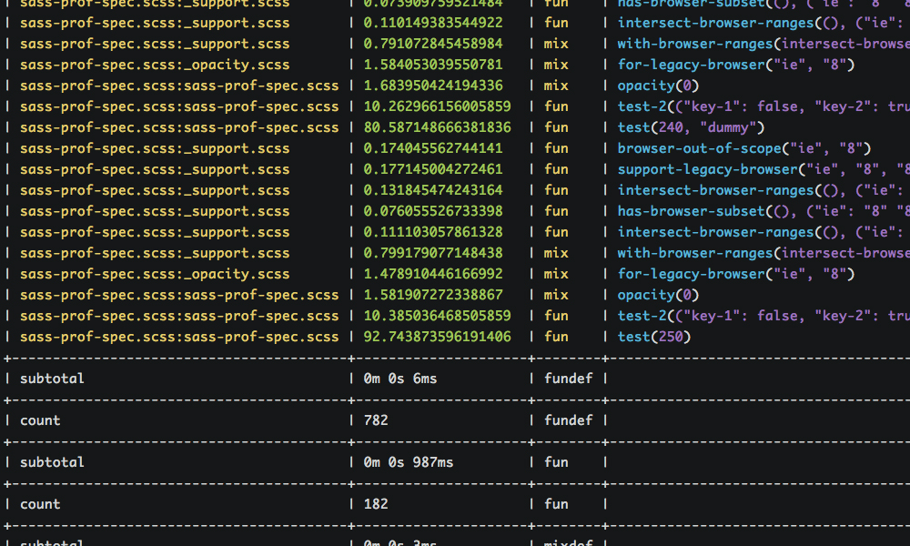

# Sass Prof

[](https://rubygems.org/gems/sass-prof)



Sass Prof is a code profiler for [Sass](https://github.com/sass/sass). For each function, Sass Prof will show the execution time for the function, which file called it and what arguments were given when the function was called.

## Requirements

* Sass ~> `3.4.0`

## Installation

1. Install with `gem install sass-prof`
2. If you're using Compass, add `require "sass-prof"` to your `config.rb`
3. Sass Prof will automatically run next time you compile
4. That's it!

## Uninstall
1. Remove the line `require "sass-prof"` from your `config.rb`

## Usage
You may specify a few options within your `config.rb`, such as directing output to a log file.

```ruby
require "sass-prof"

# Instance of Sass::Prof's configuration
prof = Sass::Prof::Config

# Directs all output to a log file
# Default is `false`
prof.output_file = "sass-prof.log"

# Adjust max column width
# Default is `false`
prof.max_width = 40

# Mutes all output to stdout
# Default is `false`
prof.quiet = true

# Maximum execution time allowed in ms
# Default is `100`
prof.t_max = 500

# Alias for `t_max`
prof.max_execution_time = 15

# Enable colored output
# Default is `true`
prof.color = true

# Execution time integer precision
# Default is `15`
prof.precision = 5
```

_Please note: your compile times **will be slower** due to the overhead of **Sass Prof**. This library was created to help you find potential bottlenecks within your code. If you find any bugs or inconsistencies, please file an [issue](https://github.com/ezekg/sass-prof/issues) or [pull request](https://github.com/ezekg/sass-prof/pulls)._

## Contributing

1. Fork it ( https://github.com/ezekg/sass-prof/fork )
2. Create your feature branch (`git checkout -b my-new-feature`)
3. Commit your changes (`git commit -am 'Add some feature'`)
4. Push to the branch (`git push origin my-new-feature`)
5. Create a new Pull Request

## Todo

- [ ] Add proper rspec tests
- [ ] Add support for `@mixin`'s
